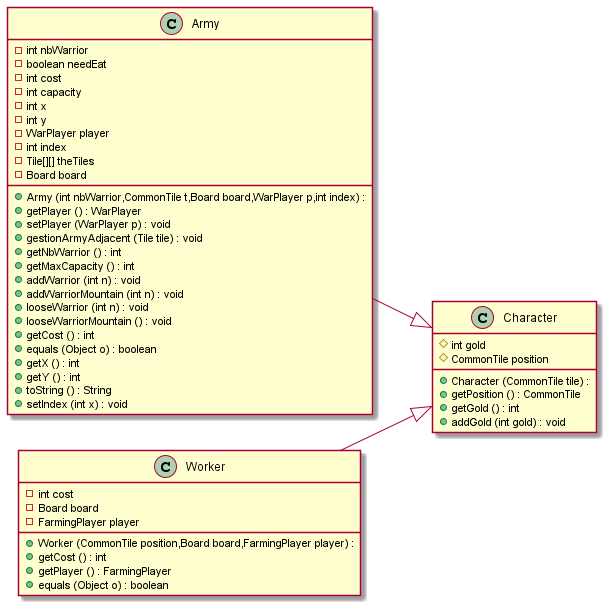
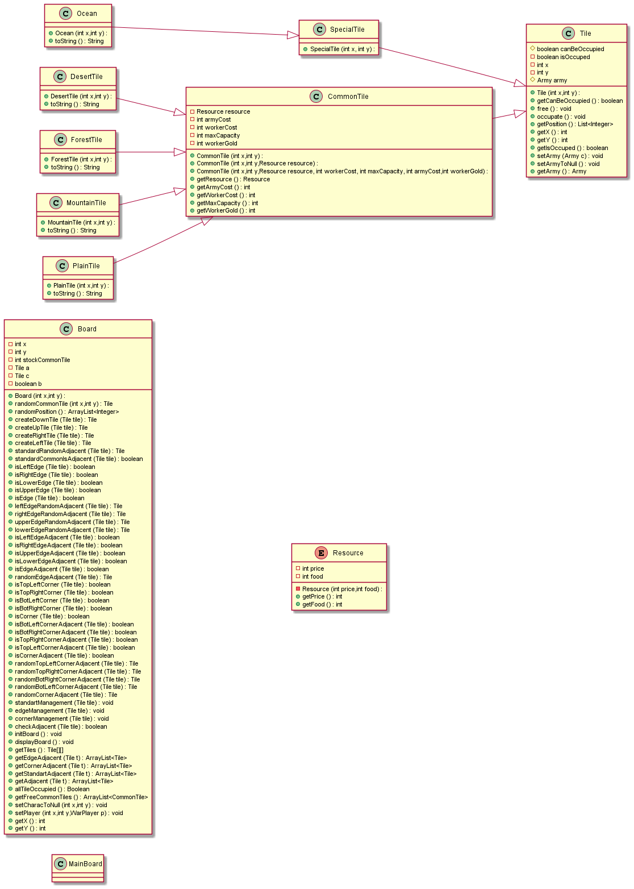
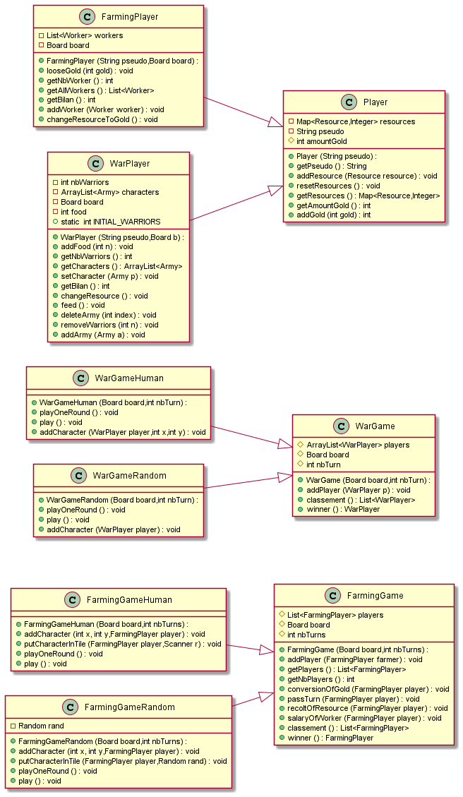
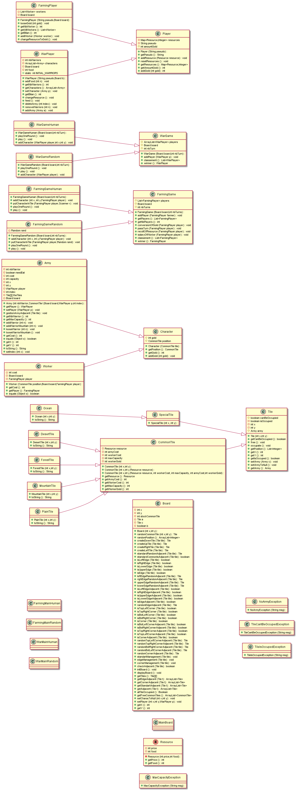

# l2s4-projet-2021

# Equipe

- Nawfel Senoussi
- Abass Youssouf Adaweh
- Romain Morel
- Felix Vuylsteker

# Sujet

[Le sujet 2021](https://www.fil.univ-lille1.fr/portail/index.php?dipl=L&sem=S4&ue=Projet&label=Documents)

# Livrables

## Livrable 1

### Atteinte des objectifs

- Pour les workers, nous avons réussi à réaliser la modélisation.
- Pour les army, nous avons réussie à faire la modélisation.

### Difficultés restant à résoudre

- Pour la classe Character nous nous mettrons d'accord en fin de projet pour essayer de rajouter du code qui sera hérité dans Army et Worker (fait).  

## Livrable 2

### Atteinte des objectifs

- Nous avons reussie à faire les Ressources, le Board, Les Tile. 

### Difficultés restant à résoudre

- Pour le Board notre première version ne fonctionnait pas puis nous avons décomposée toutes les fonctions

## Livrable 3

### Atteinte des objectifs

- Nous avons reussie a faire les classes Wargame et Warplayer.

### Difficultés restant à résoudre

- Nous hésitons encore sur la modélisation des ressources, même si nous penchons plus vers des hashMap pour pouvoir mieux stocker les différentes ressources (résolu, utilisation de HashMap)
- Nous devons voir pour la fonction deliverGold pour la transfomer en deliver pour qu'elle puisse fonctionnait pour les 2 type de game.
- Nous avons eu du mal avec les actions de Army donc on a due rajouter un accés au board et player pour army.
- Pour les combats entre les armée nous avons du rajouté des fonctions dans board pour voir les armée dans les Tiles adjacentes.

## Livrable 4

### Atteinte des objectifs

- Le jeu agricole est terminé 
- Le jeu de guerre est terminé
- Implémentation de l'interaction sur les deux jeux

### Difficultés restant à résoudre

- Problème visualisation des combats et perte d'armées et modélisation a faire pours visualiser les échanges de ressources
- Trouver une solution pour que displayboard() nous donnes les infos des armées présente sur les cases (résolu)
- Dernier problème au niveau de la suppression des Workers lors de leur mort (résolu)

# Fonctionnement jeux avec stratégie interactive au clavier

- Dans un premier temps il faut compiler les fichiers java a l'aide de la commande(depuis la racine du projet):

make cls

- Ensuite utilisez la commande:

make agricoleHuman.jar (ou guerreHuman.jar)

- Maintenant vous pouvez vous dirigez vers le fichier jar et vous constaterez que le fichier agricoleHuman.jar (ou guerreHuman.jar) sera présent

- Effectuez la commande(depuis le dossier jar):

java -jar agricoleHuman.jar (ou guerreHuman.jar)  

- A partir de la, suivez les instructions a l'écran

# Journal de bord

## Semaine 1

Début de la conception du diagramme UML des Personnages

## Semaine 2

Fin de la conception du diagramme UML des Personnages et attribution des tâches.

Tâches: 

- Félix Vuystleker et Romain Morel --> Code de Army.java et ses tests.

- Abass Youssouf Adaweh et Nawfel Senoussi --> Code de Character.java, Worker.java et ses tests.

## Semaine 3

Début de la conception du code java des différentes classes.

Documentation faite pour toutes les méthodes, mais il manque le code de certaines fonctions.

## Semaine 4

Fin du code de Army.java et Character.java manque seulement les tests et le code de Worker.java.

Conception du diagramme UML du plateau effectuer.

## Semaine 5
Correction code Character Ajout Code du Board des tiles des ressource d'un main
!!! le constructeur de board a quelques ratées du a des problèmes que l'on as pas su résoudre !!!

## Semaine 6

Fin code board et correction sur les characters (ajouter fonction toString sur les Tiles)
- Félix Vuylsteker Romain Morel -->Code Board
- Abass Youssouf Adaweh et Nawfel Senoussi --> UML actions ,correction de character et fonctions toString pour les tiles.

## Semaine 7

Finalisation du diagramme UML des actions et début du code des actions. Corps des méthodes effectuées
ajout code WarPlayer

## Semaine 8
- Félix Vuylsteker Romain Morel -->Game,WarGame,WarPlayer,modification Army,ajout accés a board pour Army soit WarPlayer
ajout getTiles a board
- Abass Youssouf Adaweh et Nawfel Senoussi --> Player,FarmingPlayer,FarmingGame

## Semaine 9
- Félix Vuylsteker Romain Morel -->ajout des taches de la semaine 8 gestion de la nouriture non finis car en attente de Player+modification des UML+corrections d'erreurs
- Nawfel Senoussi - Abass Youssouf --> Finalisation de Player et manque 2 fonctions en rapport avec les Ressources a finir + correction de quelques problèmes dans Player,FarmingPlayer et WarPlayer

## Semaine 10
- Félix Vuylstker Romain Morel --> correction winner() + ajout hashmap dans player+ WarMain (il reste des erreurs a corrigé)
- Nawfel Senoussi - Abass Youssouf --> Fin du FarmingPlayer + avancement sur les tests et création du makefile.

## Semaine 11
- Nawfel Senoussi - Abass Youssouf --> Fin du jeu agricole, tout fonctionne, manque quelques tests et la gestion de la suppression des workers
- Félix Vuylstker Romain Morel --> Fin du WarMainRandom.
## Semaine 12

- Nawfel Senoussi - Abass Youssouf --> changement de package pour plus de clarté dans le code et ajustement des tests
- Félix Vuylstker Romain Morel --> changement package pour plus de clarté correction structure du main et correction pb montagne