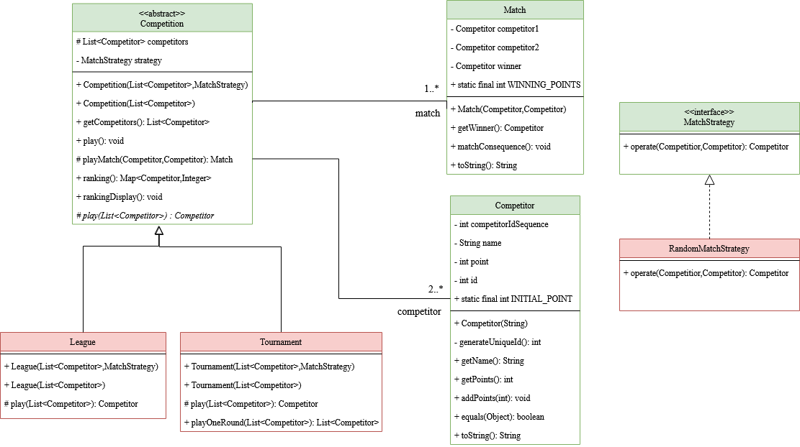
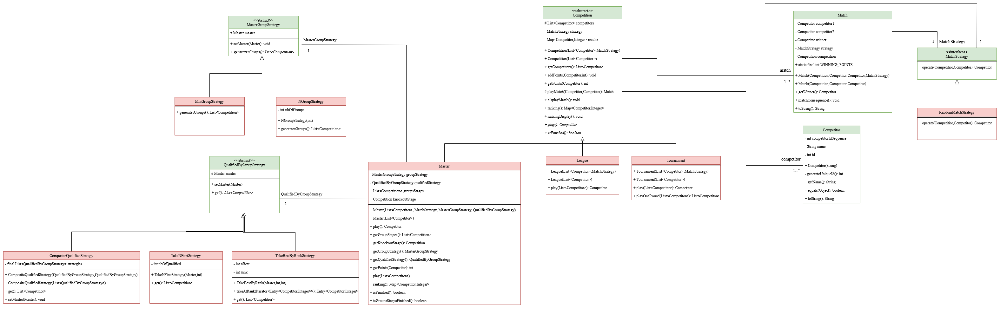
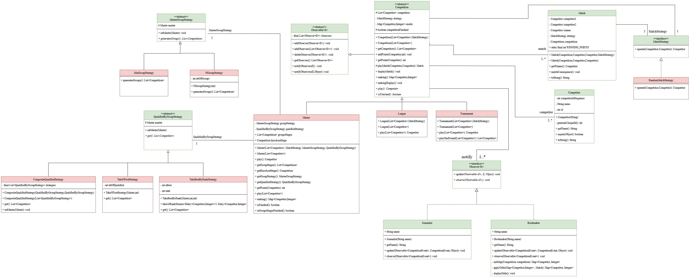

# Morel-Senoussi_Projet_COO

## **Membres du binôme**

- Nawfel Senoussi
- Romain Morel

## **Présentation du projet**

Le but de ce projet est de créer différentes compétitions avec des matchs qui peuvent être joué de plusieurs manières différentes (aléatoire,truqué, etc ...)


## **HowTo**

### *Récupération du dépôt*

```
git clone https://gitlab.com/senoussin/morel-senoussi_projet_coo.git
```

### *Commande de génération de la documentation*

```
make doc
```

### *Commande de compilation du projet*

```
make cls
```

### *Commande de génération de l’archive du projet*

Si vous avez déjâ un dossier jar présent à la racine du projet, effectuez la commande suivante:

```
rmdir jar
```
puis effectuez la commande suivante:

```
make jar
```

### *Commande d’exécution de l’archive générée*

```
cd jar;
java -jar game.jar <Joueur1> <Joueur2> <...>
```

---

# Livrables

## Livrable 1



### Atteinte des objectifs

- Conception des Match
- Conception des Competitor
- Conception des Competition
- Création du Main
- Fonctionnement des competitons

### Explications des choix de conception

#### Match

- Utilisation du Design Pattern Strategy pour pouvoir ajouter des strategy de match plus facilement par la suite (jouer de manière aléatoire, truqué, etc...)

#### Competition

- Nous avons choisi de mettre une MatchStrategy en attribut Competition pour savoir de quelle manière la competition va se jouer

- Nous avons choisi de mettre une méthode play() sans argument qui applique play(competitors) (qui prend une liste de competitors en paramètres et aura une manière de s'appliquer différentes en fonction du type de competition)

- La méthode playMatch a été remonté au niveau de competition pour éviter les répétitions car les matchs sont lancés de la même manière dans toutes les compétitions (seul la manière de jouer les matchs changent)

- La méthode ranking renvoie la liste des joueurs classé dans l'ordre, et nous avons créée une autre méthode rankingDisplay pour afficher ce classement 

---

## Livrable 2



### Atteinte des objectifs

- Conception de la classe Master
- Réalisation des tests
- Redéfinition de la manière de stocker les points
- Le ranking de la classe Master renvoi bien le bon classement final
- Conception du design pattern pour la création des groupes
- Conception du design pattern pour la séléction des qualifiés pour la phase finale 

### Explications des choix de conception

#### Points

- Nous avons décidé de changer la conception des points qui était auparavant dans la classe Competitor, nous avons donc mis les points dans les competitions (et les méthodes/tests qui lui sont associées).
- Le changement de conception des points est dû au fait qu'un competitor peut participer à plusieurs competitions en même temps, il aura donc un nombre de points différents entre chaque competition.

#### Master

- Utilisation du design pattern template method pour la méthode play dans la classe Master
- Nous avons redéfini la méthode ranking dans la classe Master (qui est défini de base dans la classe Competition) pour avoir une méthode ranking qui ne prend pas seulement le joueur avec le plus de point
- Nous avons mis les deux strategies (QualifiedByGroupStrategy et MasterGroupStrategy) dans le constructeur de master pour pouvoir plus facilement changer de manière d'effecteur le Master

---

## Livrable 3



### Atteinte des objectifs

- Conception des Bookmaker
- Conception des Journalist
- Gestion des Observer
- Application des updates (côte pour Bookmaker et affichage Journalist)

### Explications des choix de conception

- Utilisation du design pattern observer pour gérer les "Abonnements" aux compétitions
- Utilisation de eventType pour indiquer aux "Abonnés" quel type de notifications ils recoivent

#### Master

- Pour gérer le cas des Master, nous avons décidé de réabonner tout les abonnés au Master au compétition "fille", pour qu'ils suivent puis la competition entière

- Les bookmakers affichent les côtes de chaque groupe a chaque fin de match

---

# Journal de bord

## Semaine 1

- Initialisation du projet (Makefile, gitignore, etc...)
- Création de l'UML
- Création du corps des méthodes
- Création de la classe Competitor et de ses tests
- Création de la classe Match (gestion des tests aléatoires à finir)

## Semaine 2

- Gestion des problèmes de tests aléatoires sur la classe Match effectué
- Création de la classe League et de ses tests


## Semaine 3

- Explications du code et de notre point de vue a l'autre Binome
- Avancement dans Tournament et avancement des Tests
- Corrections d'erreurs des différents codes

## Semaine 4

- Finalisation du Main
- Correction de conception au niveau des competitions
- Avancement des tests
- Fin Livrable 1

## Semaine 5

- Réflexion sur la manière de faire pour créer la classe Master, qui utilisera les classes League et Tournament
- Début de l'UML

## Semaine 6

- Mise en accord de l'UML
- Clarification des docs
- Choix de l'utilisation du design pattern template method pour la méthode play

## Semaine 7

## Semaine 8

- Codage de la classe Master
- Changement de conception des points
- Gestion de l'affichage des competitions
- Tests réalisés (problème avec le classement des tournois)

## Semaine 9

- Codage de la partie Master dans le Main
- Le Master se déroule bien, tout fonctionne
- Ajout des stratégies dans la classe Master

## Semaine 10

- Conception du diagramme UML pour l'ajout des Bookmaker et Journalist

## Semaine 11

- Début codage des Bookmakers et Journalist

## Semaine 12

- Conception des Bookmaker, Journalist ainsi que les classes Observable et observer
- Ecriture des tests
- Maj des documentations
- Peaufinage de l'UML
- Rendu Livrable 3

--

** Remarques **
- Le diagramme de classes doit être sous format image pour qu'il puisse être vu facilement.
- c'est dommage que l'affichage soit dans playMatch. Ce serait mieux de l'externaliser.
- est-ce que getWinner() renvoie le gagnant du match ou celui qui a gagné le plus de matchs ?
- je ne comprends pas playTest dans LeagueTest, ni playMatchTest. En particulier, ce sont les assertions que je ne comprends pas bien.
- pourquoi la méthode init n'est pas dans CompetitionTest plutôt que dans LeagueTest ou dans TournamentTest ?
- pourquoi l'égalité des compétiteurs ne se fait que sur les noms ?
